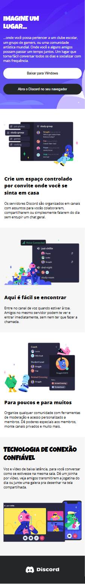
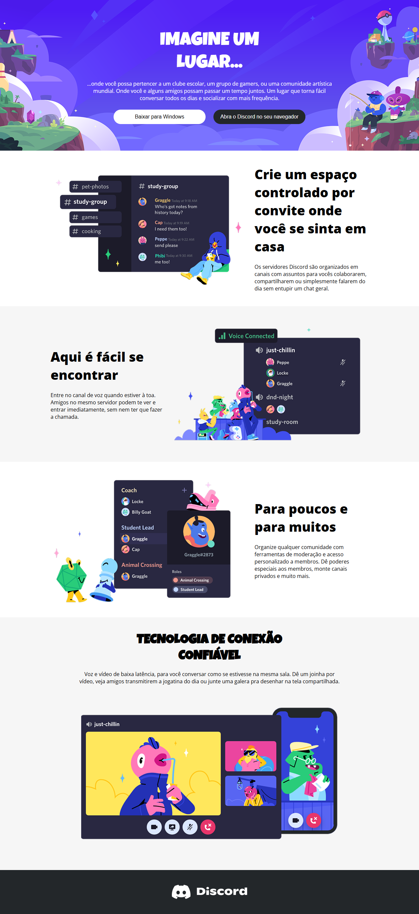

# Desafio Responsividade DIO
Projeto de clonagem da página do discord (mobile-first)

## Imagens do Projeto
### Mobile:

### Desktop

## Tecnologia
- HTML
- CSS

[Clique aqui](https://desafio-responsividade-dio-ismaelrodr.netlify.app/) para acessar o resultado final da Landing Page criada a partir do desafio!